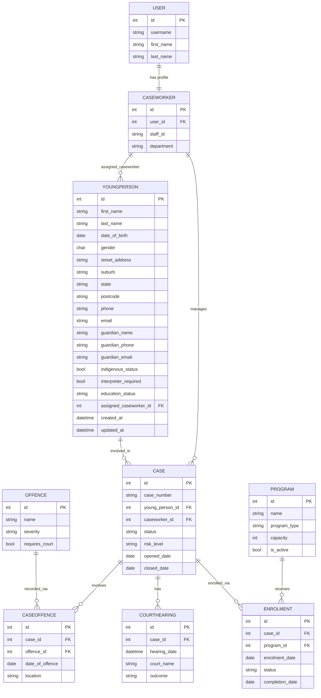

# Entity Relationship Diagram — Version 2
**Updated for Assessment 4**

---

## ERD — Mermaid



---

## Assessment 4 changes to YoungPerson

| Old (A2) | New (A4) | Reason |
|---|---|---|
| `address = TextField` | `street_address`, `suburb`, `state`, `postcode` | Structured fields enable filtering and reporting |
| (missing) | `email`, `guardian_email` | Contact channels for staff |
| (missing) | `interpreter_required` | Court hearing logistics |
| (missing) | `education_status` with choices | Key risk factor in youth justice |
| (missing) | `indexes on last_name, first_name` | Search uses `icontains` — index improves performance |

## Service layer data flow

```
HTTP Request
    ↓
View — validates input, calls service, catches domain exceptions
    ↓
Service — enforces domain rules, raises named exceptions
    ↓
Model — data, constraints, business logic methods
    ↓
Database
```
