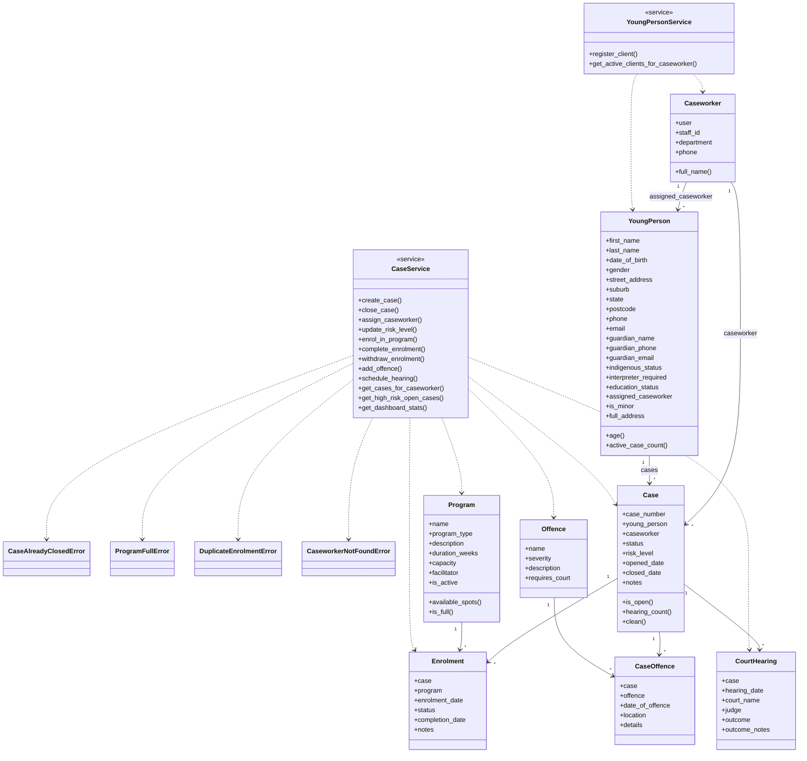

# Class Diagram v2

```mermaid
classDiagram
    class CaseAlreadyClosedError
    class ProgramFullError
    class DuplicateEnrolmentError
    class CaseworkerNotFoundError

    class Caseworker {
        +user
        +staff_id
        +department
        +phone
        +full_name()
    }

    class YoungPerson {
        +first_name
        +last_name
        +date_of_birth
        +gender
        +street_address
        +suburb
        +state
        +postcode
        +phone
        +email
        +guardian_name
        +guardian_phone
        +guardian_email
        +indigenous_status
        +interpreter_required
        +education_status
        +assigned_caseworker
        +age()
        +is_minor
        +full_address
        +active_case_count()
    }

    class Offence {
        +name
        +severity
        +description
        +requires_court
    }

    class Case {
        +case_number
        +young_person
        +caseworker
        +status
        +risk_level
        +opened_date
        +closed_date
        +notes
        +is_open()
        +hearing_count()
        +clean()
    }

    class CaseOffence {
        +case
        +offence
        +date_of_offence
        +location
        +details
    }

    class CourtHearing {
        +case
        +hearing_date
        +court_name
        +judge
        +outcome
        +outcome_notes
    }

    class Program {
        +name
        +program_type
        +description
        +duration_weeks
        +capacity
        +facilitator
        +is_active
        +available_spots()
        +is_full()
    }

    class Enrolment {
        +case
        +program
        +enrolment_date
        +status
        +completion_date
        +notes
    }

    class CaseService {
        <<service>>
        +create_case()
        +close_case()
        +assign_caseworker()
        +update_risk_level()
        +enrol_in_program()
        +complete_enrolment()
        +withdraw_enrolment()
        +add_offence()
        +schedule_hearing()
        +get_cases_for_caseworker()
        +get_high_risk_open_cases()
        +get_dashboard_stats()
    }

    class YoungPersonService {
        <<service>>
        +register_client()
        +get_active_clients_for_caseworker()
    }

    Caseworker "1" --> "*" YoungPerson : assigned_caseworker
    Caseworker "1" --> "*" Case : caseworker
    YoungPerson "1" --> "*" Case : cases
    Case "1" --> "*" CaseOffence
    Offence "1" --> "*" CaseOffence
    Case "1" --> "*" CourtHearing
    Case "1" --> "*" Enrolment
    Program "1" --> "*" Enrolment

    CaseService ..> Case
    CaseService ..> Enrolment
    CaseService ..> Program
    CaseService ..> Offence
    CaseService ..> CourtHearing
    CaseService ..> CaseAlreadyClosedError
    CaseService ..> ProgramFullError
    CaseService ..> DuplicateEnrolmentError
    CaseService ..> CaseworkerNotFoundError

    YoungPersonService ..> YoungPerson
    YoungPersonService ..> Caseworker
```
